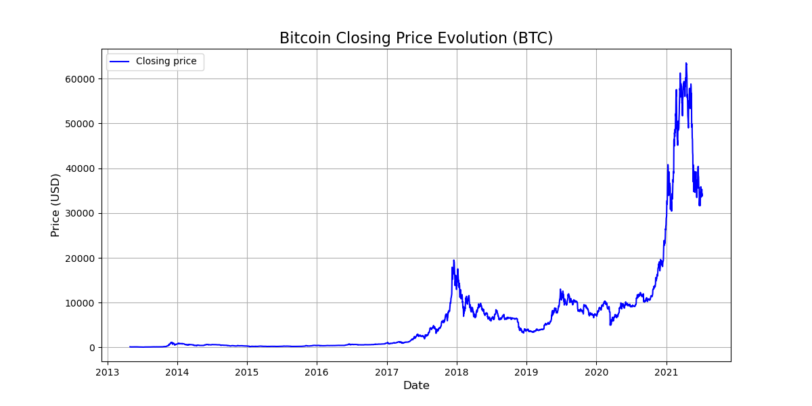

<link rel="stylesheet" href="/style.css">
# CryptoForecast: A Time-Series Forecasting Prototype for Cryptocurrency Prices

* [Our Members](#our-members)
* [1. Introduction](#introduction-)
* [2. Datasets](#datasets-)
* [3. Methodology](#methodology-)
* [4. Evaluation & Analysis](#evaluation--analysis-)
* [5. Related Work](#related-work)

## Our Members

* **Clement Tikhomiroff**
  * *dpt of computer science, Hanyang University*
  * *clement.tikhomiroff@gmail.com*
* **Victor Venail**
  * *dpt of computer science, Hanyang University*
  * *victor.venail@edu.ece.fr*
* **Elodie Huang**
  * *dpt of computer science, Hanyang University*
  * *elodie.huang@edu.ece.fr*
* **Cindy HU**
  * *dpt of computer science, Hanyang University*
  * *cindy.hu@edu.ece.fr*

## 1 Introduction :

Predicting the evolution of financial markets is often compared to “predicting the unpredictable” a challenge that reaches its peak with cryptocurrencies. Indeed, we are talking about high volatile market which can either make you rich or makes you lose everything.

Indeed, this year, the cryptocurrency ecosystem has been shaken by exceptional volatility, far exceeding that of traditional markets. From January 1 to October 29, 2024, the Bitcoin volatility index saw extreme peaks, much higher than those of 2023. Furthermore, the threat of a "bear market" appeared with bewildering speed.
* A bear market is a situation when the market goes down by 20% or more.

In fact, a cryptocurrency's price depends on a combination of factors to start and evolve: a supply (often limited), demand, and an underlying technology. But not all price movements are created equal.

### The "Ingredients" of a Market Movement :

* A Catalyst: This is anything that can generate sudden interest. Common catalysts are an announcement from the Federal Reserve (FED) or an ETF approval.
* Market Players: This is the available liquidity and general sentiment. Retail investors, investment funds, and "whales" (large wallets) are the typical drivers. The amount of "FOMO" (Fear of Missing Out) or "FUD" (Fear, Uncertainty, and Doubt) greatly affects how quickly a price evolves.
* Asset Nature: Certain assets, like "memecoins," are propelled by social media mechanisms and can react more quickly and intensely than established assets like Bitcoin.

### The Spread of the Movement:

Once a movement starts, it can spread rapidly depending on market sentiment and the structure of the order book.
* Social Media Sentiment: This is a key factor. The volume of mentions on X (Twitter) or Reddit is a critical element. Studies have shown that a rise in positive sentiment is linked to an increase in prices. Very high sentiment can suck up liquidity and cause prices to rise.
* Algorithmic Trading ("Bots"): The rapid interventions of high-frequency trading bots bring a new influx of orders (buy/sell) to the movement. They can also propagate cascading effects, triggering liquidations in the derivatives markets.
* Structure (Order Books): Prices tend to move faster uphill as they break through "sell walls" (resistance) than downhill. This acceleration is due to buying pressure forcing stop-loss orders located further up to be triggered, allowing them to be hit more easily.

### The Consequences:

These extreme market movements represent a major problem with diverse consequences:
* Economic Issues: Volatility can cause immense losses for unwary investors. In 2022, the collapse of several platforms destroyed billions of dollars in capital, ruining thousands of investors. These collapses disrupt economic activity by destroying confidence and freezing capital.
* Human Issues: Volatility causes immense human stress. Furthermore, the unregulated nature of the market fosters scams ("rug pulls") that target individuals. Exposure to this volatility is estimated to cause mental health problems for thousands of investors.

Faced with this continuous increase in volatility, questions arise: When will it stop? Can this risk at least be managed? And if so, what can we do? How can we better protect investors and minimize losses?

Some of these losses could have been avoided, but the vast majority were inevitable due to the nature of the market. That's why the best way to reduce damage and protect people is anticipation.

To map risk zones based on market conditions. To allow investors to prepare BEFORE a violent move. To save billions of euros in savings. To minimize the destruction of capital. To allow for better risk management by professionals and individuals who are better prepared. To collect scientific data to better understand the factors influencing the onset and intensity of these movements.

That is what our project is about. To develop a program using artificial intelligence to predict the direction and intensity of a market movement, to preserve capital and reduce the frequency of losses using the collected data.

## 2 Datasets :

To do so, we need a complete and reliable dataset to train our model. So, we decided to choose Cryptocurrency Historical Prices, a dataset which contains about 23 of the most popular cryptocurrency such as BTC , ETH or SOL.

   
   
We got here a screenshot of our project's dataset. It's a CSV file containing historical time-series data for Bitcoin (BTC).
This is the raw data our AI model will use for training. Each row represents a single day and includes the key features for our analysis:
* SNo : serial number
* Name : the name of the coin 
* Symbol : Symbol of coin
* Date : Date
* High : High value on the date
* Low : Low value on the date
* Open : Open value on the date
* Close : Close value on the date
* Volume : Volume of transactions in USD
* MarketCAP : the marketCAP of the coin which is : Current Price × Circulating Supply

Then we got the exact same type of files for the others coins.
* ps : to use updated data we passed on the y.finance librairy on python but it's basically the same type of files

This dataset is also an excellent way to study certain aspects of cryptocurrency markets.
As the chart below illustrates, Bitcoin's price action is defined by two key characteristics: high volatility and non-linear dynamics.
This means the price exhibits sudden, large-scale fluctuations (volatility) and does not follow a simple, predictable straight-line path (non-linearity). A basic linear model would be incapable of capturing this behavior.

This complexity is precisely what makes it a perfect challenge for an AI model.

## 3 Methodology :

To transform raw data into actionable predictions, we needed a robust algorithmic approach. Predicting a price isn't just about looking at numbers; it is about understanding sequences and temporal dependencies. Since financial data is a time-series problem, standard regression models are often insufficient.

Therefore, our methodology relies on a specific type of Artificial Intelligence capable of "remembering" past trends to forecast future ones: **Deep Learning**.

### Data Preprocessing & Acquisition

Before feeding data to the AI, we must prepare the "ingredients." As mentioned in the Datasets section, we switched from static CSV files to a dynamic approach using the **`yfinance` API**. This allows our tool to be always up-to-date with the latest market movements.

Once the data is retrieved, we apply two critical transformations:

* **Normalization:** Cryptocurrency prices can range from $0.10 (Dogecoin) to $90,000 (Bitcoin). To avoid confusing the neural network with such scale differences, we compress all values between 0 and 1 using a **`MinMaxScaler`**.
* **Sliding Window Technique:** We don't just give a date to the AI. We give it a context. We created sequences of **60 days**. The model learns that *"Sequence A (Day 1 to 60)"* leads to *"Target B (Day 61)."*

### The Model: Long Short-Term Memory (LSTM)

For the core of our project, we chose the **LSTM (Long Short-Term Memory)** network. This is a special kind of Recurrent Neural Network (RNN) designed specifically to avoid the "short-term memory" problem of traditional RNNs.

Why LSTM? Because in crypto, context matters. A price drop today might be a correction after a month of rallying, or the start of a crash. The LSTM can distinguish between these by maintaining a "cell state"—a memory of what happened long ago in the sequence.

Our architecture is built as follows:

* **Input Layer:** Takes the 60-day sequence of normalized prices.
* **LSTM Layers:** Two layers of 50 units each. They process the sequence, identifying patterns like "bull runs" or "consolidations."
* **Dropout Layers:** To prevent "overfitting" (when the AI memorizes the data instead of learning from it), we randomly deactivate 20% of the neurons during training.
* **Dense Output Layer:** A final neuron that aggregates the information to output a single value: the predicted price for the next day ($t+1$).

### Implementation Tools

To build this "CryptoForecast" prototype, we utilized a standard Python stack for Data Science:

* **TensorFlow/Keras:** For building and training the Deep Learning model.
* **Pandas & NumPy:** For data manipulation and matrix operations.
* **Matplotlib:** To visualize the prediction curves against the real prices.
* **Streamlit** To quickly create a website without using HTML or CSS.

In essence, our methodology is about teaching the machine to recognize the "shape" of the market over the last two months to anticipate the very next step.

## 4 Evaluation & Analysis :

After training our LSTM model on the Bitcoin dataset (using both Price and Volume features), we moved to the critical phase: testing. It is not enough to simply "predict" a number; we must verify if the curve generated by the AI actually follows market reality.

To evaluate our model, we used a **"Sliding Window" approach on the test set**, representing the last 20% of our available data.

### Visual Inspection: Tracking the Trend

The most immediate way to judge the quality of our model is visual. By plotting the **Actual Prices (Blue)** against the **Predicted Prices (Orange)**, we can observe the model's behavior.

**Observations:**
* **Trend Following:** The model successfully captures the global trend. When Bitcoin enters a "bull run," the prediction curve rises accordingly.
* **Smoothing Effect:** The AI tends to be less volatile than the real market. It filters out some of the daily "noise," resulting in a smoother curve.
* **The "Lag" Phenomenon:** We noticed a slight delay (lag) of about 1 day in sudden market reversals. This is common with LSTM models, which rely heavily on past momentum to predict the future.

### Quantitative Metrics

To go beyond simple observation, we calculated specific error metrics to quantify performance.

#### 1. Root Mean Squared Error (RMSE)
This metric tells us, on average, how far our prediction is from the real price (in dollars).

* **Result:** On Bitcoin, our RMSE is **3012.37 USD**.
* **Interpretation:** Given that Bitcoin trades at high values (between $60k and $100k during the test period), an average error of ~$3k represents a deviation of only **3-4%**. This confirms that the model has learned the general valuation of the asset effectively.

#### 2. Directional Accuracy (The "Up or Down" Test)
For a trader, the exact price matters less than the direction. Did the price go UP or DOWN as predicted? We compare the sign of the predicted move vs. the actual move.

* **Result:** Our model achieves a Directional Accuracy of **47.99%**.
* **Critical Analysis:** This result is slightly below random guessing (50%). This highlights the difficulty of predicting short-term volatility (daily fluctuation) based solely on past Price and Volume. While the model is excellent at following the **trend** (low RMSE), it struggles to anticipate the exact **pivot points** for the very next day without external data (like news or sentiment).

### Impact of Multivariate Analysis (Price vs. Volume)

We compared our initial "Univariate" model (Price only) with our improved "Multivariate" model (Price + Volume).

* **With Price Only:** The model was more reactive but prone to "fake outs" (reacting to price spikes that had no volume support).
* **With Price + Volume:** The prediction curve became more stable. The model learned that a price increase *without* volume is often not sustainable, leading to more conservative predictions.

### Limitations & Future Work

Despite a good RMSE, the low directional accuracy highlights two main limitations to address in future versions:

1.  **Black Swan Events:** The model fails to predict sudden crashes caused by external news (e.g., a geopolitical event), as this information is not present in the CSV data.
2.  **Need for Sentiment Data:** To improve the 47.99% accuracy, integrating **Sentiment Analysis** (Twitter/News) is essential, as crypto markets are heavily driven by emotion rather than just technical charts.

## 5 Related Work 

 

